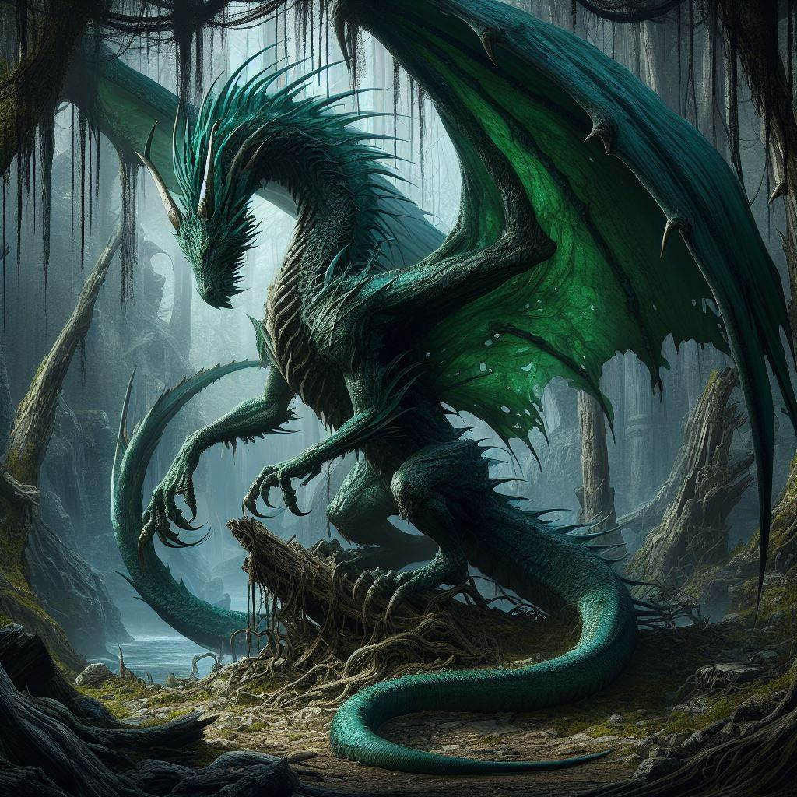

---
creation date: 2024-04-29 20:12 
modification date: Monday 29th April 2024 20:12:10 
name: Stratherax
type: npc 
campaign: VisDraconis
race: Smaragtdrache
faction:
alignment: ?
tags:

--- 

# [[Stratherax]]

Tags: #NPC #Drache

### Aussehen:

### Beschäftigung:
- Mitglied der [[Smaragtenklave]] und daher Teil des [[Rat von Waterdeep]]

### Informationen:
- Ist sehr alt
- Ehem. Hüter des [[Blue Orb of Dragonkind]]
- DM Notes: Sein Dungeon is trippy as fuck! 
- Hat [[Die Party]] darüber informiert, dass [[Die Roten]] eigentlich [[Thayaner]] sind
