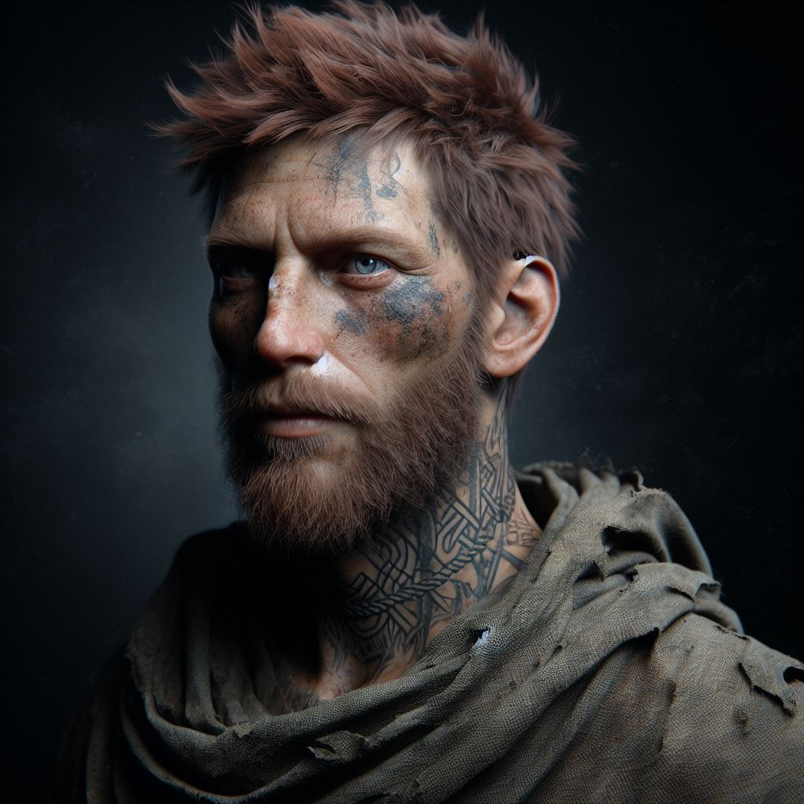

---
creation date: 2024-04-07 19:55 
modification date: Sunday 7th April 2024 19:55:13 
name: Tarak
type: npc 
campaign: VisDraconis
race: Mensch
faction: Runara
alignment: ?
tags:

--- 

# [[Tarak]]

Tags: #Drachenruh #Runara 

### Aussehen:

- Tatoo um Hals, Seil
- Symbol der Diebesgilde "zum Goldenen Galgen"
- Tarak ist ein Mensch im späten mittleren Alter. Er hat blasse, dunkler gebräunte Haut mit vielen Sommersprossen, kastanienbraunes Haar und einen Bart, der meist grau ist, sowie graublaue Augen. Verblasste Tätowierungen in einem abstrakten Muster lugen an der Seite seines Halses unter seinem schmutzigen Gewand hervor.

### Beschäftigung:
- Wohnt in [[Drachenruh]]
- Ehemaliges Mitglied der Diebesgilde [[Goldener Galgen]]

### Informationen:

