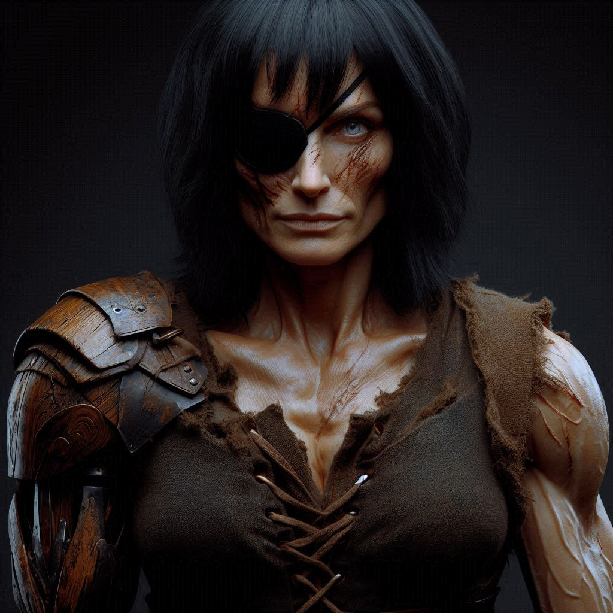

---
creation date: 2024-04-23 21:04 
modification date: Tuesday 23rd April 2024 21:04:27 
name: Varnoth
type: npc 
campaign: VisDraconis
race: 
faction:
alignment: ?
tags:

--- 

# [[Varnoth]]

Tags: #Runara #Drachenruh 

### Aussehen:

### Beschäftigung:
- Instandhaltung des Tempels und anderer Bereiche des Klosters in [[Drachenruh]]

### Informationen:
- Varnoth war ein gefürchteter General an der Spitze einer Söldnertruppe namens [[Azure Wolves]].

